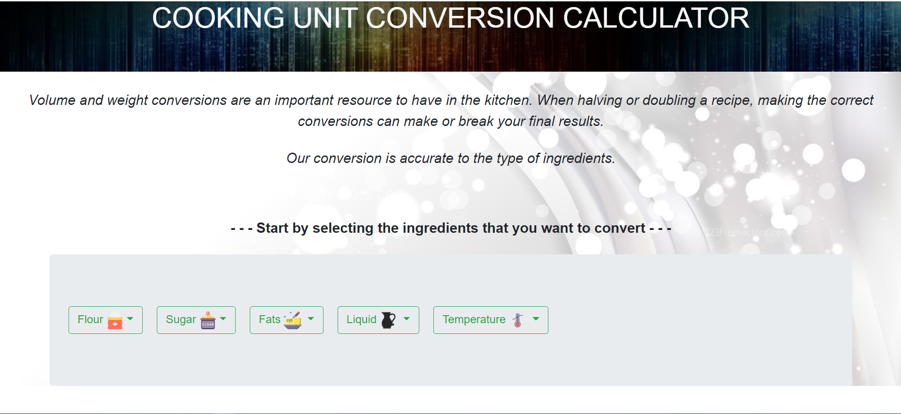
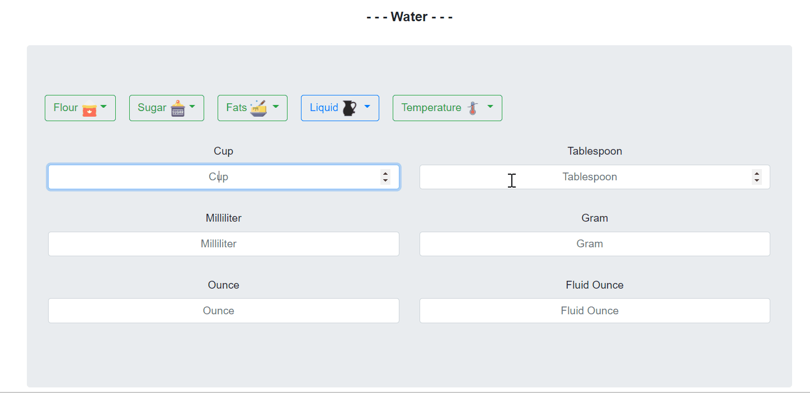

# Cooking Unit Conversion
 Welcome to my first personal project on HTML5, CSS3, and Javascript. 
 This calculator is accurate to the type of ingredients, and units of measurement

Build for efficiency and to reduce the number of clicks during usage, my Cooking Unit Conversion generates the conversion results instantly as the user keys in their data. 

This is my first (html + css + javascript) project after learning the languages during the holidays of 2020. This application was build with the original intention to aid me with my baking ventures. I will be adding more ingredients/conversion units in the future to cater to more recipes! 

CSS Framework:Bootstrap
